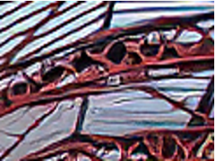
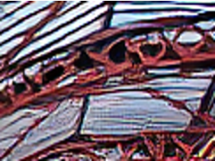
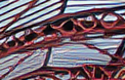

<div align="center">

# [ICCV 2023] On the Effectiveness of Spectral Discriminators for Perceptual Quality Improvement

Xin Luo, Yunan Zhu, Shunxin Xu, Dong Liu

[[`Paper`](https://arxiv.org/abs/2307.12027)] [[`Video`](https://youtu.be/q3LPOeCi6sc)] [[`BibTeX`](#heart-citing-us)] :zap: :rocket: :fire:

[](https://github.com/pre-commit/pre-commit)
[](https://pytorch.org/get-started/locally/)
[](#license)

</div>

<br>

## 📌 Overview

>Several recent studies advocate the use of spectral discriminators, which evaluate the Fourier spectra of images for generative modeling. However, the effectiveness of the spectral discriminators is not well interpreted yet. We tackle this issue by examining the spectral discriminators in the context of perceptual image super-resolution (i.e., GAN-based SR), as SR image quality is susceptible to spectral changes. Our analyses reveal that the spectral discriminator indeed performs better than the ordinary (a.k.a. spatial) discriminator in identifying the differences in the high-frequency range; however, the spatial discriminator holds an advantage in the low-frequency range. Thus, we suggest that the spectral and spatial discriminators shall be used simultaneously. Moreover, we improve the spectral discriminators by first calculating the patchwise Fourier spectrum and then aggregating the spectra by Transformer. We verify the effectiveness of the proposed method twofold. On the one hand, thanks to the additional spectral discriminator, our obtained SR images have their spectra better aligned to those of the real images, which leads to a better PD tradeoff. On the other hand, our ensembled discriminator predicts the perceptual quality more accurately, as evidenced in the no-reference image quality assessment task.

## :star: News
* Sept. 28, 2023: ***Training code is released!***
* July. 19, 2023: We release our test code and models, training and analysis code will be released at the end of September.
<!-- ### Highlights
* More models and configurations will be open source soon, we need some time to organise our data and code. -->

## :sunflower: Main Results
|[ESRGAN](https://arxiv.org/abs/1809.00219)|[SPSR](https://openaccess.thecvf.com/content_CVPR_2020/papers/Ma_Structure-Preserving_Super_Resolution_With_Gradient_Guidance_CVPR_2020_paper.pdf)|[ESRGAN+LDL](https://arxiv.org/abs/2203.09195)|[ESRGAN<br>+DualFormer(Ours)](https://arxiv.org/abs/2307.12027)|
|:-----:|:-----:|:-----:|:-----:|
|PSNR/SSIM/LPIPS|PSNR/SSIM/LPIPS|PSNR/SSIM/LPIPS|PSNR/SSIM/LPIPS|
|28.0465/0.7669/0.1597|28.3978/0.7821/0.1069|28.2440/0.7758/0.1133|29.3049/0.8023/0.1030|
|||||
|||||

## Installation
This implementation based on [BasicSR](https://github.com/xinntao/BasicSR), please refer to it to get more information on usage.

```
# create a virtual environment [Recommended but optional]
conda create -n dual_former python=3.9
source activate dual_former

# Install necessities
# In DualFormer/
pip install --user -e .
```

## :rocket: Usage
Download our [pretrained models](https://drive.google.com/drive/folders/1iGS32Qux9mr4SJt2Zb7XTv4Xq6zLEy6I?usp=drive_link) (for both SR and IQA), and place the contents in experiments/pretrained_models/ (you will need to create these directories first, e.g., `mkdir -p experiments/pretrained_models`, if you are in project root directory.)

<details>
<summary><b>x4 Super Resolution (Bicubic degradation)</b></summary>

* Download the [DIV2K](https://data.vision.ee.ethz.ch/cvl/DIV2K/), [BSD100 and Urban100](https://cv.snu.ac.kr/research/EDSR/benchmark.tar), test datasets, and place them in datasets/.
* Evaluate models.
  ```shell
  python basicsr/test.py -opt options/test/test_esrgan_x4_dual_former.yml
  ```

</details>

<details>
<summary><b>x4 Super Resolution (Hard gated degradation model)</b></summary>

* Download the test dataset from [here](), place it in datasets/.
* [Optional] You may also generate the test dataset yourself using the provided method (*note that the resulting dataset may differ slightly from what was used in the paper due to randomness in the degradation synthesis process*):
  ```shell
  python scripts/generate_hgd_dataset.py \
  --input datasets/DIV2K/DIV2K_valid_HR \
  --hr_folder datasets/DIV2K/HGD/HR/X4 \
  --lr_folder datasets/DIV2K/HGD/LR/X4 \
  --scale 4
  ```
* Evaluate models.
  ```shell
  # ESRGAN version
  python basicsr/test.py -opt options/test/test_esrgan_x4_hgd_dual_former.yml
  # BebyGAN version
  python basicsr/test.py -opt options/test/test_bebygan_x4_hgd_dual_former.yml
  ```

</details>

<details>
<summary><b>Opinion Unaware No-Reference IQA</b></summary>

<!-- * Use our pretrained model or train it by yourself. You need prepare DF2K+OST dataset under the [guideline](https://github.com/xinntao/Real-ESRGAN/blob/master/docs/Training.md#dataset-preparation).
  ```shell
  bash scripts/train/srgan/train_realesrgan_x4_sgd_wgan_unet_psm-m.sh # ESRGAN + U-Net + PSM-M under Simple Gated Degradation model, it uses 2 GPUs.
  bash scripts/train/srgan/train_realesrgan_x4_sgd_wgan_vgg_psm-m.sh
  ``` -->
* Download the IQA datasets [KonIQ-10k](http://database.mmsp-kn.de/koniq-10k-database.html), [LIVE-itW](https://live.ece.utexas.edu/research/ChallengeDB/index.html), [PIPAL](https://www.jasongt.com/projectpages/pipal.html), and place them in dataset/.
* Start testing.
  ```shell
  bash scripts/test/test_iqa_vgg_specformer.sh
  bash scripts/test/test_iqa_dual_former.sh
  ```

</details>
<!--   
### Test datasets and pretrained models
Download our datasets and models from [there](https://zenodo.org/record/7604356#.Y93SSezP3P8), `unzip` these .zip and put files in experiments/pretrained_models/ (you need create these directories at first, e.g., `mkdir -p experiments/pretrained_models/` if you are in project root directory.)

<!-- Use our pretrained model or train it by yourself.

You need prepare DF2K+OST dataset first under the [guideline](https://github.com/xinntao/Real-ESRGAN/blob/master/docs/Training.md#dataset-preparation).
  ```shell
  # [Optional] train PSNR-oriented model. You could use our pretrained PSNR-oriented model.
  bash scripts/train/esrgan/train_esrnet_x4_hgd.sh
  bash scripts/train/esrgan/train_esrgan_x4_hgd_psm-t.sh # ESRGAN + PSM-T under Hard Gated Degradation model, it require 4 GPUs.
  ```
* To evaluate models trained with Hard Gated Degradation model, you have to download corresponding test sets. Datasets are generated using Hard Gated Degradation model with following command:
  ```shell
  # It generates lr images contain hard gated degradation for DIV2K valid set, BSD100, Urban 100 (note that this would not exactly same as our used, since we have not set random seed before).
  bash scripts/generate_hgd_dataset.sh
  ```
* Test it
  ```shell
  python basicsr/test.py -opt options/test/ESRGAN/test_esrgan_x4_hgd_psm-t.yml # modify config properly
  ```

### NR-IQA
* Use our pretrained model or train it by yourself. You need prepare DF2K+OST dataset under the [guideline](https://github.com/xinntao/Real-ESRGAN/blob/master/docs/Training.md#dataset-preparation).
  ```shell
  bash scripts/train/srgan/train_realesrgan_x4_sgd_wgan_unet_psm-m.sh # ESRGAN + U-Net + PSM-M under Simple Gated Degradation model, it uses 2 GPUs.
  bash scripts/train/srgan/train_realesrgan_x4_sgd_wgan_vgg_psm-m.sh
  ```
* Download IQA datasets [KonIQ-10k](http://database.mmsp-kn.de/koniq-10k-database.html), [LIVE-itW](https://live.ece.utexas.edu/research/ChallengeDB/index.html), [PIPAL](https://www.jasongt.com/projectpages/pipal.html) and [guider](https://github.com/YunanZhu/RecycleD/tree/main/datasets) files for testing, guider files should be put into datasets/IQA_guider/
* Test a trained (on SR) discriminator for NR-IQA.
  ```shell
  bash scripts/test/test_iqa_PIPAL_unet_PSM-M.sh
  bash scripts/test/test_iqa_PIPAL_unet_PSM-T.sh
  bash scripts/test/test_iqa_PIPAL_vgg_PSM-M.sh
  bash scripts/test/test_iqa_PIPAL_vgg_PSM-T.sh

  # see scripts/test/ for more scripts.
  ``` -->

<!-- <details>
<summary><b>Analyses</b></summary> -->

***Furthermore, we provide our code for analysis, so as to facilitate and promote further research.***

<details>
<summary><b>Calculate magnitude RMSE in frequency range for DIV2K validation set</b></summary>

  1. Download [DIV2K](https://data.vision.ee.ethz.ch/cvl/DIV2K/) dataset and place it (or using `ln -s` in linux to make a soft link) under datasets/.
  2. Download officially pretrained [Real-ESRNet](https://github.com/xinntao/Real-ESRGAN/releases/download/v0.1.1/RealESRNet_x4plus.pth)/[Real-ESRGAN](https://github.com/xinntao/Real-ESRGAN/releases/download/v0.1.0/RealESRGAN_x4plus.pth) models, place them in experiments/pretrained_models.
  3. Execute the code below to reproduce Tab.1 in our paper. Three ranges are $[0, \frac{3}{10}),[\frac{3}{10}\frac{8}{10})$, and $[\frac{8}{10},1]$ respectively, corresponding roughly to the divisions in Fig. 1a of the paper.
  
  ```shell
  # For Real-ESRNet
  python scripts/estimate_difference_in_frequency_range.py --model_path experiments/pretrained_models/RealESRNet_x4plus.pth

  # For Real-ESRGAN
  python scripts/estimate_difference_in_frequency_range.py --model_path experiments/pretrained_models/RealESRGAN_x4plus.pth # The resultant numbers may slightly differ from those in Tab.1 of our paper, as we utilized our own reproduced model in the paper
  
  # Test other dataset
  python scripts/estimate_difference_in_frequency_range.py --dataset_opt other_dataset.yml # Please ref to options/DIV2K_valid.yml see how to make a proper dataset configuration
  ```

</details>

<details>
<summary><b>Plot the spectral profile of a model on a dataset</b></summary>

  1. [Optional] Generate datasets (It is required in following example)
  ```shell
  # Generate LR images for DIV2K validation set utilizing Second-order degradation model (note that the resulting dataset would not exactly same as we used, since random seed was not set beforehand).
  bash scripts/generate_realesrgan_dataset.sh # modify the file to change the path
  ```
  2. Estimate statistics
  ```shell
  # Estimate statistics of HR images
  python scripts/estimate_spectral_statistics.py --input datasets/DIV2K/RealESRGAN/HR/X4 --experiment_name spectral_analysis_G_DIV2K_train_HR_patch_size_256 --mode 1 --patch_size 64

  # Estimate statistics of Real-ESRNet's outputs
  python scripts/estimate_spectral_statistics.py --input datasets/DIV2K/RealESRGAN/LR/X4 --experiment_name spectral_analysis_G_realesrnet_DIV2K_x4_patch_size_256 --mode 0 --model_path experiments/pretrained_models/RealESRNet_x4plus.pth --patch_size 64
  
  # Estimate statistics of Real-ESRGAN's outputs
  python scripts/estimate_spectral_statistics.py --input datasets/DIV2K/RealESRGAN/LR/X4 --experiment_name spectral_analysis_G_realesrgan_DIV2K_x4_patch_size_256 --mode 0 --model_path experiments/pretrained_models/RealESRGAN_x4plus.pth --patch_size 64
  ```
  3. Plot the spectral profile
  ```shell
  # modify the file for your needs
  python scripts/plot_spectral_profile.py
  ```

</details>

<details>
<summary><b>Evaluate the robustness of a discriminator under frequency masking and noise</b></summary>
<!-- 
  ```shell
  bash scripts/robustness_analysis.sh
  ``` -->

</details>

## :boat: Train
<details>
<summary><b>x4 Super Resolution (Bicubic degradation)</b></summary>

1. Prepare DF2K dataset under the [guideline](https://github.com/xinntao/Real-ESRGAN/blob/master/docs/Training.md#dataset-preparation) (just ignore OST part), and organize data according to `datasets` item in `options/train/train_esrgan_x4_dual_former.yml`.

2. Download pretrained [ESRNet](https://drive.google.com/file/d/1swaV5iBMFfg-DL6ZyiARztbhutDCWXMM/view?usp=drive_link), and place it in experiments/pretrained_models/.

3. Start your training.
```shell
python basicsr/train.py --auto_resume -opt options/train/train_esrgan_x4_dual_former.yml
```

4. Test results.
```shell
# Modify pretrain_network_g to your model path
python basicsr/test.py -opt options/test/test_esrgan_x4_dual_former.yml
```

</details>

<details>
<summary><b>x4 Super Resolution (Hard gated degradation model)</b></summary>

1. Prepare DF2K+OST dataset under the [guideline](https://github.com/xinntao/Real-ESRGAN/blob/master/docs/Training.md#dataset-preparation),  and organize data according to `datasets` item in `options/train/train_esrgan_x4_hgd_dual_former.yml`.

2. [Optional] Train PSNR-oriented model. *By default, step 3 will use our pretrained PSNR-oriented model, you could modify option file to use yours.*
```shell
CUDA_VISIBLE_DEVICES=0,1,2,3 \
scripts/dist_train_autoresume.sh 4 options/train/train_esrnet_x4_hgd.yml # it require 4 GPUs.
```

3. Start your training.
```shell
CUDA_VISIBLE_DEVICES=0,1,2,3 \
scripts/dist_train_autoresume.sh 4 options/train/train_esrgan_x4_hgd_dual_former.yml # it require 4 GPUs.
```

4. Test results.
```shell
# Modify pretrain_network_g to your model path
python basicsr/test.py -opt options/test/test_esrgan_x4_hgd_dual_former.yml
```
</details>

<details>
<summary><b>Opinion Unaware No-Reference IQA</b></summary>

1. Prepare DF2K+OST dataset under the [guideline](https://github.com/xinntao/Real-ESRGAN/blob/master/docs/Training.md#dataset-preparation), organize data according to `datasets` item in `options/train/train_esrgan_x4_sgd_dual_former.yml`.

2. [Optional] Train PSNR-oriented model. *By default, step 3 will use our pretrained PSNR-oriented model, you could modify option file to use yours.*
```shell
CUDA_VISIBLE_DEVICES=0,1 \
scripts/dist_train_autoresume.sh 2 python basicsr/train.py --auto_resume -opt options/train/train_esrnet_x4_sgd.yml # it require 2 GPUs.
```

3. Start your training.
```shell
CUDA_VISIBLE_DEVICES=0,1 \
scripts/dist_train_autoresume.sh 2 options/train/train_esrgan_x4_sgd_vgg_specformer.yml # it require 2 GPUs.

CUDA_VISIBLE_DEVICES=0,1 \
scripts/dist_train_autoresume.sh 2 options/train/train_esrgan_x4_sgd_dual_former.yml # it require 2 GPUs.
```

4. Test results.
```shell
# You should modify these two scripts accordingly, name, path etc...
bash scripts/test/test_iqa_vgg_specformer.sh
bash scripts/test/test_iqa_dual_former.sh
```

</details>

## :heart: Citing Us
If you find this repository or our work useful, please consider giving a star :star: and citation :t-rex:, which would be greatly appreciated:

```bibtex
@inproceedings{luo2023effectiveness,
	title={On the Effectiveness of Spectral Discriminators for Perceptual Quality Improvement},
	author={Luo, Xin and Zhu, Yunan and Xu, Shunxin and Liu, Dong},
	booktitle={ICCV},
	year={2023}
}
```

## :email: Contact
If you have any questions, please open an issue (*the recommended way*) or contact us via 
- xinluo@mail.ustc.edu.cn

## License
This work is licensed under MIT license. See the [LICENSE](https://github.com/Luciennnnnnn/DualFormer/blob/main/LICENSE) for details.

## Acknowledgement
Our repository builds upon the excellent framework provided by [BasicSR](https://github.com/XPixelGroup/BasicSR).